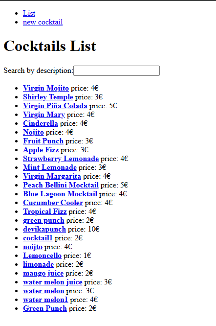
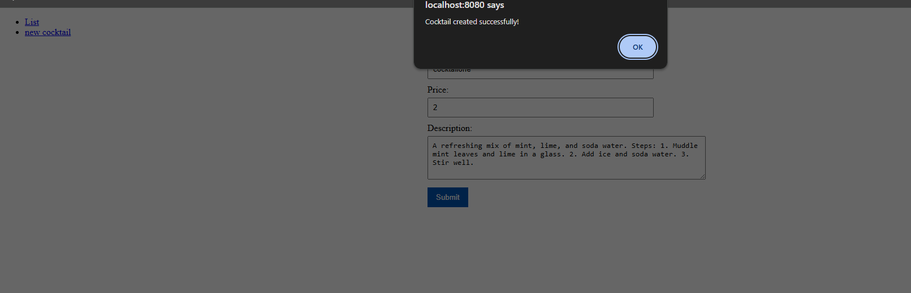
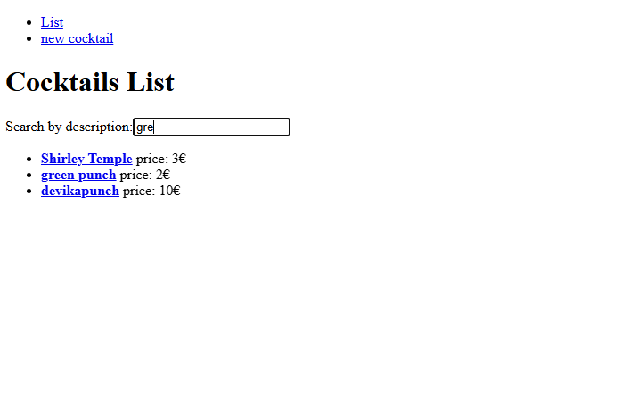
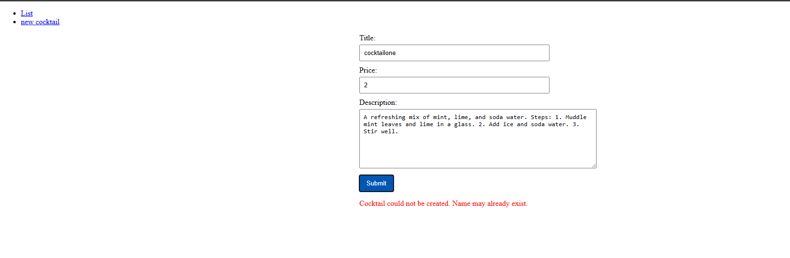
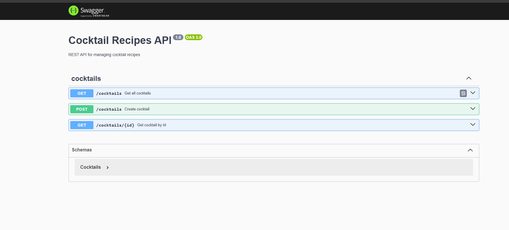

# Cocktail Recipes Application

A simple full-stack cocktail recipes application built with:

- Frontend: Vue 3
- Backend: NestJS
- Database: PostgreSQL
- API Documentation: Swagger/OpenAPI

## Features Implemented

### Mandatory Requirements

✅ Cocktail Details View

- Added navigation from the cocktail list to a dedicated cocktail details page.
- Created a new backend endpoint to retrieve a cocktail by id.
- Added client-side routing for cocktail details.





### Search by Description

- Implemented filtering of cocktails by description.
- Search is case-insensitive.
- Filtering updates dynamically as the user types.



### Error Feedback on Cocktail Creation

- Added frontend error handling for API failures.
- User receives feedback when a cocktail cannot be created (for example because the title already exists).
  

### Bonus Feature

✅ OpenAPI / Swagger Documentation

Interactive API documentation available at:

```
http://localhost:3000/api
```



---

## API Endpoints

### Get All Cocktails

```http
GET /cocktails
```

### Get Cocktail By Id

```http
GET /cocktails/{id}
```

### Create Cocktail

```http
POST /cocktails
```

Example payload:

```json
{
  "title": "Green Punch",
  "description": "Refreshing green punch",
  "price": 2
}
```

---

## Running the Application

### Start with Docker

```bash
docker compose up --build
```

### Backend

```bash
cd backend
npm install
npm run start:dev
```

Backend URL:

```
http://localhost:3000
```

Swagger URL:

```
http://localhost:3000/api
```

### Frontend

```bash
cd frontend
npm install
npm run dev
```

Frontend URL:

```
http://localhost:8080/
```

---

## Technical Notes

- Cocktail details page uses a dedicated REST endpoint (`GET /cocktails/:id`).
- Search functionality is implemented on the client side because the dataset is small and pagination is not required.
- The API returns a `404 Not Found` response when a cocktail cannot be found.
- The API returns a `409 Conflict` response when duplicate cocktail is added.
- Swagger/OpenAPI documentation was added to improve API discoverability and developer experience.

---

## Future Improvements

- Integration tests for API endpoints.
- Elasticsearch-based fuzzy search on title and description.
- DTO validation using `class-validator`.
- Improved user notifications instead of browser alerts.
- Case-insensitive uniqueness validation for cocktail titles.

---
